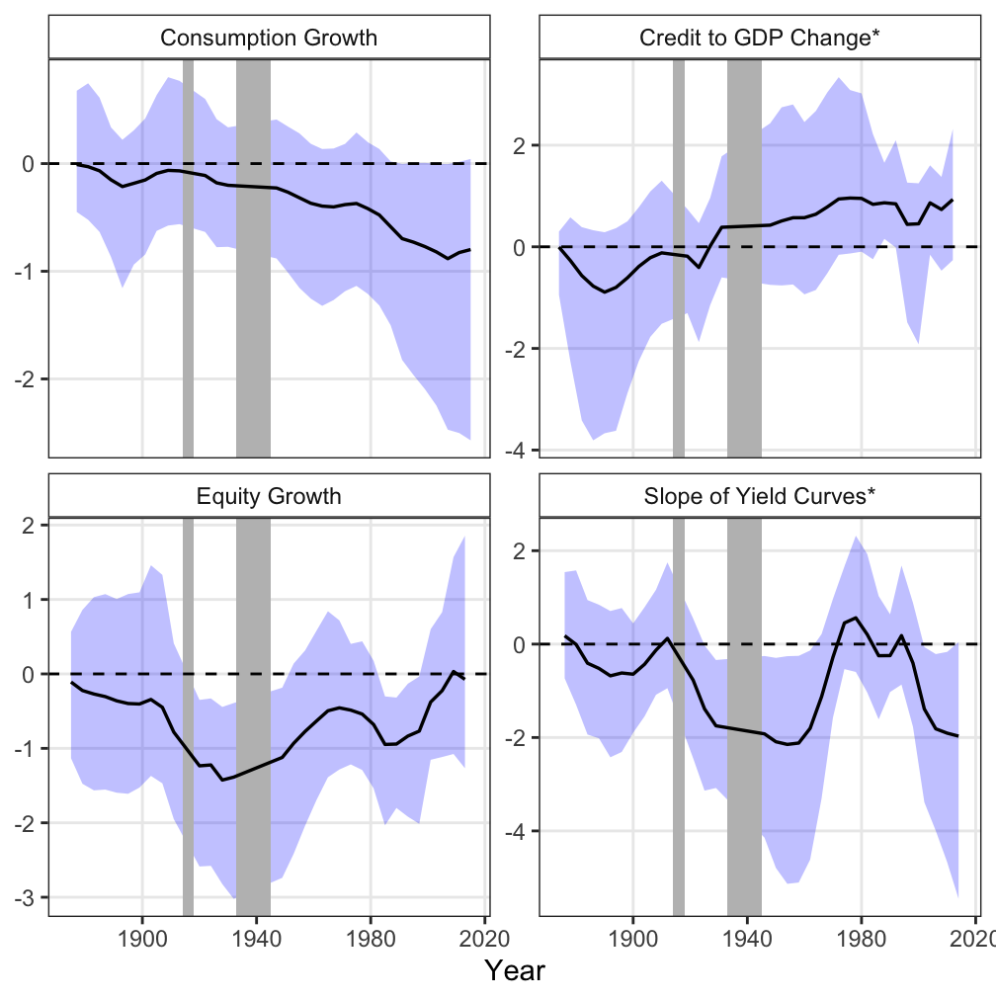

# Stable-and-Time-varying-Early-Warning-Indicators-of-Financial-Crises-A-Bayesian-Approach

## Abstract
Previous studies have endeavored to identify early warning indicators (EWIs) that are useful in predicting financial crises. This paper aims to categorize a multitude of explanatory variables into three distinct groups: stable EWIs, time-varying EWIs with varying utility over time, and irrelevant variables for financial crisis prediction by utilizing a sparse time-varying parameter (sparse-TVP) model. This paper offers two significant contributions. Firstly, through data-driven analysis, stable EWIs and time-varying EWIs were identified from a wide range of macroeconomic variables. Stable EWIs include the credit-to-GDP ratio and the instability of bank funding structures, which is consistent with the broad literature of EWIs specification. Additionally, global total credit-to-GDP ratio, which has gained prominence since the 1980s, was identified as a time-varying EWI. This finding implies the increasing necessity of considering the influence of global financial cycles to comprehend the underlying mechanisms of financial crises in the past a few decades. Secondly, the proposed sparse-TVP model exhibits superior predictive accuracy compared to alternative techniques assuming fixed parameters, such as logistic regression, LASSO regression, and some RNN-type models. This result suggests that the dynamics of EWIs provide valuable insights not only into past financial crisis mechanisms but also for forecasting future financial crises.

## Features

The model uses macro-financial indicators from the JST dataset.  
The table below summarizes variable definitions and transformations.

### Financial Crisis Variable (Dependent Variable)
We construct the financial crisis indicator using the Jordà–Schularick–Taylor (JST) Macrohistory Database (Jordà, Schularick, and Taylor, 2017), which provides the most comprehensive cross-country macro-financial dataset currently available. The database covers annual macroeconomic and financial variables for 16 advanced economies over the period 1870–2017.
Systemic financial crises are defined following Schularick and Taylor (2012) as events in which a country’s banking sector experiences severe distress, including bank runs, sharp increases in default rates, large capital losses, and subsequent public intervention, bankruptcy, or forced mergers of financial institutions.

#### Crisis Label Construction
- The baseline crisis indicator equals 1 in the year marking the onset of a systemic financial crisis in a given country.
- To enable early warning prediction, the dependent variable is set to 1 for one and two years prior to the crisis onset, capturing the pre-crisis phase.
- The crisis year itself and the four subsequent years are excluded from the analysis to avoid post-crisis bias, following Bussière and Fratzscher (2006). These periods are characterized by recovery dynamics and adjustment processes that do not reflect transitions from healthy to crisis regimes.
Sample Exclusions
#### To ensure consistency and avoid structural distortions, the following observations are excluded:
- Post-crisis recovery years (crisis year + four years)
- 1933–1939, corresponding to the later phase of the Great Depression
- World War I (1914–1918) and World War II (1939–1945)
- All observations with missing values in any explanatory variables
These exclusions ensure that the model focuses on economically meaningful transitions from normal conditions to systemic financial crises.

### Explanatory Variables

| Variable               | Transformation    | Definition                                            |
| ---------------------- | ----------------- | ----------------------------------------------------- |
| Credit                 | 2-year difference | Total loans to non-financial private sectors / GDP    |
| Credit*                | 2-year difference | Global average of credit to GDP ratio                 |
| Capital asset ratio    | 2-year difference | Tier 1 capital / total assets                         |
| Noncore funding ratio  | 2-year difference | Other liabilities / (deposits + other liabilities)    |
| Investment             | 2-year difference | Investment / GDP                                      |
| Current account        | 2-year difference | Current account / GDP                                 |
| Exchange rates         | 2-year difference | Real exchange rates to US Dollar                      |
| Public debt            | level             | Public debt / GDP                                     |
| Slope of yield curves  | level             | Long-term interest rates − short-term interest rates  |
| Slope of yield curves* | level             | Global average of yield curve slopes                  |
| Equity price           | 2-year growth     | 2-year real total return (capital gain and dividends) |
| Inflation rate         | 2-year growth     | 2-year growth of consumer price index                 |
| Consumption            | 2-year growth     | 2-year growth of real consumption                     |
| House price            | 2-year growth     | 2-year growth of real house price index               |

#### Notes
- All explanatory variables are normalized to have a mean of zero and a standard deviation of one.
- Variables transformed into growth rates are winsorized at the 5th percentile in both upper and lower tails to mitigate the influence of outliers.

## Model Specification

We consider a time-varying parameter model defined as follows:

$$
\beta_t = \beta_{t-1} + \omega_t \tag{1}
$$
 
$$
q_t = x_t \beta_t \tag{2}
$$

where

$$
\omega_t \sim \mathcal{N}_p(0, Q).
$$

Here, $\beta_t$ is a $p$-dimensional vector of time-varying coefficients, $x_t$ denotes the corresponding explanatory variables at time $t$, and $Q$ is the ($p$, $p$)covariance matrix governing the evolution of the state process with a $p$-dimensional vector **$\theta$** = { $\theta_1$,..., $\theta_p$} as its diagonal elements.

### Properties of $\beta$ and $\theta$ values
The objective is to categorize the numerous explanatory variables into three types: 1) stable EWI, 2) time-varying EWI, and 3) irrelevant variables for prediction.

| Category               | $\beta_j$ values | $\theta_j$ values |
|------------------------|------------|------------|
| Stable EWIs            | non-zero   | zero       |
| Time-varying EWIs      | non-zero   | non-zero   |
| Irrelevant variables   | zero       | zero       |

In other words, the goal is to distinguish between $\beta_j$ and $\theta_j$ values that are close to zero and those that are not. To find this, the study uses Bayesian inference framework using **Shrinkage Prior**.

### Shrinkage Prior
It is desirable to employ a shrinkage prior that exhibits the property of shrinking the estimates of state variables to zero when the they are in close proximity to zero, while returning the estimated value without shrinkage when it is significantly distant from zero. The study uses the **horseshoe prior**, which is computationally advantageous and typically used in this context, to perform baseline estimation. For $j$ = 1, ... , $p$, the model assumes the following prior distributions for parameters.

$$
\beta_{j,1} \mid \lambda_j, \tau \sim N\left(0, \tau^2 \lambda_j^2 \right) \tag{3}
$$
 
$$
\lambda_j \sim C^+(0, 1) \tag{4}
$$
 
$$
\tau \sim C^+(0, \tau_0) \tag{5}
$$

$$
\theta_j \mid \kappa_j, \xi \sim N\left(0, \xi^2 \kappa_j^2 \right) \tag{6}
$$
 
$$
\kappa_j \sim C^+(0, 1) \tag{7}
$$
 
$$
\xi \sim C^+(0, \xi_0) \tag{8}
$$

$\tau_0$ and $\xi_0$ are the hyper-parameters which reflect the prior assumptions about the degree of shrinkage of $\tau$ and $\xi$, respectively. Since there is no strong consensus on their calibration, they are commonly set to 1 in empirical applications. Here, the hyper parameters are set to be 0.8 and 1, respectively, following Piironen and Vehtari(2017) The model is estimated with MCMC sampling.

## Results
Medians of the estimated posterior distributions are as follows. 

**Time-varying coefficients estimated from the Sparse TVP model**

Coefficients of all variables are as follows.

**Coefficients of All Variables**

**Coefficients of Time-Varying EWIs**

**Coefficients of Stable EWIs**

